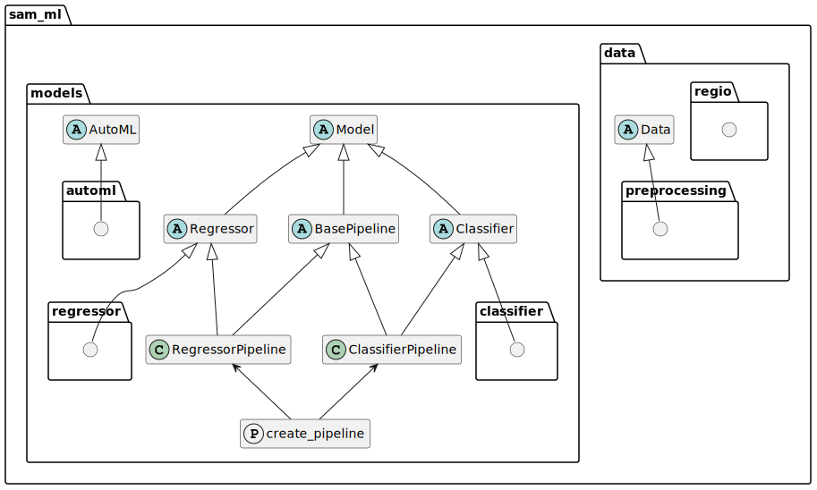

Package Graph
=============

.. note::

    Class Factory :func:`create_pipeline <sam_ml.models.create_pipeline>`

    Creates **DynamicPipeline** class dynamically 
    based on input model (:class:`Classifier` or :class:`Regressor`)
